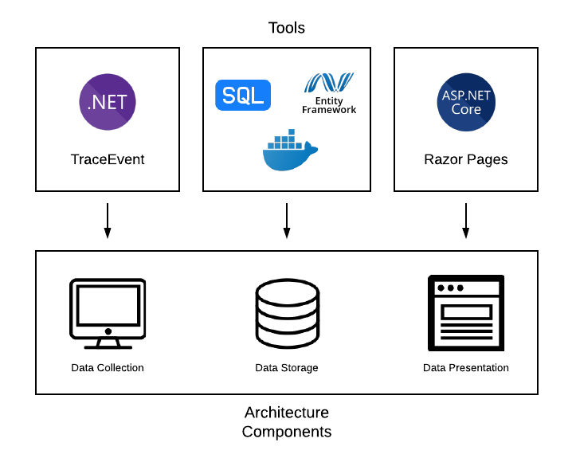

[](https://performancemonitor.visualstudio.com/MyFirstProject/_build/latest?definitionId=1)

# .NET Core PerformanceMonitor

## Architecture Overview



The Performance Monitor application allows .NET Core 2.1 developers to track application performance metrics via a web application. The application consists of three major components: performance data collection, data storage and handling, and data presentation. 

### Data Collection
The first step of the process, data collection, is performed by a C# class library function that simply needs to be included in the beginning of the user's application code. The function will trigger application performance reading on the user's machine, and periodically send packets of data to an Azure SQL database. To utilize this service, include the PerfMonitor library and write the following at the start of the tracked application's Main method or equivalent:

```cs
Monitor monitor = new Monitor(String application_name, int sampling_rate, int transmission_rate);
monitor.Record();
```

All arguments for _Monitor_ class instantiation are optional - the default sampling rate is one second and the default transmission rate (rate at which data is sent to the server) is five seconds. If a rate is specified, the arguments should be provided in milliseconds and the sampling rate value should be smaller than the transmission rate value for expected performance. Providing an application name will allow an application with multiple processes to have its processes grouped within the performance monitor's tracking. To do so, simply run performance monitoring for each process simultaneously, with each Monitor instantiation specifying the same application name.

This will trigger performance metric tracking that is done on the user's machine through two channels. The first of these channels is the _System.Diagnostics_ namespace, which is used to fetch the current process to be tracked. This process can then have its CPU and memory usage fetched via the _Process.TotalProcessorTime_ and _Process.WorkingSet64_ fields. The CPU usage reported by the monitor tool represents the percentage of total CPU on the machine, accounting for the number of logical cores present (which is detected via the _System.Environment_ class).

The other channel for data collection is the TraceEvent library (repo found here: https://github.com/Microsoft/perfview/tree/master/src/TraceEvent). A new TraceEvent session is initialized upon starting the program, and delegates are added for responses to certain exception, GC, contention, JIT, and HTTP request events (request events will only be triggered by interaction with ASP.NET Core applications). A list of tracked events and how they are collected can be found further on in this document within the technical detail section. Handling events via TraceEvent is not done with a controlled sampling rate, since event responses are triggered live as events are discovered by the event parsers.

Data collection is (by default) performed roughly every second, by looping through a function that performs a check of the current time via _System.DateTime.Now_. Each time a piece of data is recorded, a class instance is created for the datapoint (each form of data has its own class, with fields containing relevant information for the data). This class instance is added to a Collection of the data type. Every five seconds (by default), the collected data is aggregated into a _Metric_List_ class instance - which is simply a class whose fields consist of the Collections of each monitored data type. This _Metric_List_ instance is then serialized into a JSON string, and is sent in the body of a POST request to the monitor application's web API via the _System.Net.Http.HttpClient_ class. After the data is sent, the Collections containing the datapoints are cleared and the process begins again.

### Data Storage
The data collected is currently being hosted on a SQL database running through Docker. This allows for local testing of the application. In the future, the database will be moved to AzureSQL. This will allow the final product to run with minimal setup from the user. Startup.cs holds the location of the connection string for the server, and can be changed as necessary.

Entity framework was used to manage the sending and fetching of data from the server. There are object-specific controllers for the fetching of data, and there is an all-purpose controller for sending the data in a single packet. Entity framework largely simplifies querying a SQL server, as no commands need to be written. The primary used POST request is POST/api/v1/General/ALL, which allows for pushing all the currently collected data to the server. The receiving of data is done by the specific page being used. Primarily, /api/v1/CPU/Daterange is being used to receive data from the server for CPU usage information. /api/v1/MEM/Daterange will be used to receive data for memory usage information. Data is sent and received in JSON form.


### Data Presentation
The web application is built using ASP.NET CORE and Razor Pages to create a dynamic application. To start accessing the data, users must first specify the application and process name that they want to examine (collectively, the application and process are called sessions) on the homepage. The homepage also lists all the sessions that the database has data of. Once the user enters the information, the user is given feedback on whether or not a session with the entered information exists. If that session does not exist, an error is thrown and the user is prompted to re-enter the information. If the session does exist, the user can then use the sidebar to view data gathered from their session.

## Usage Specifics