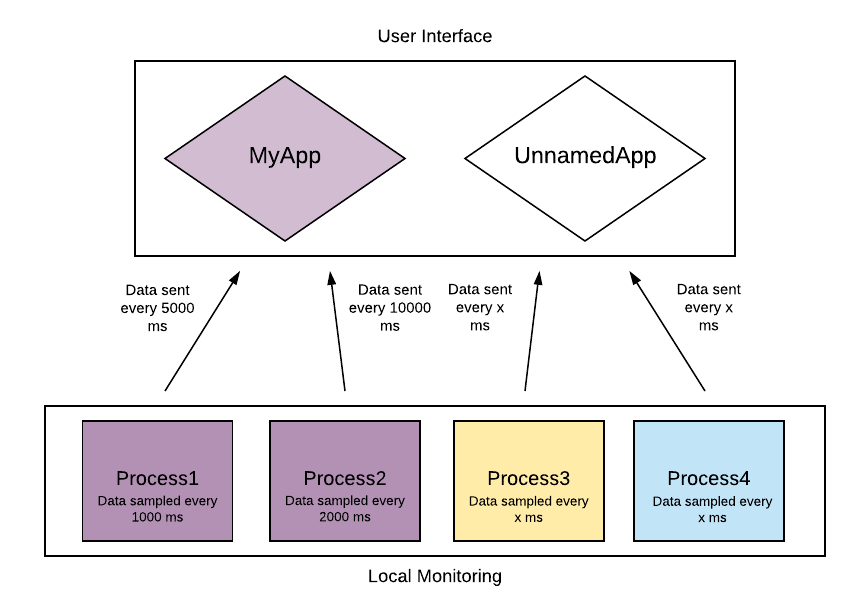
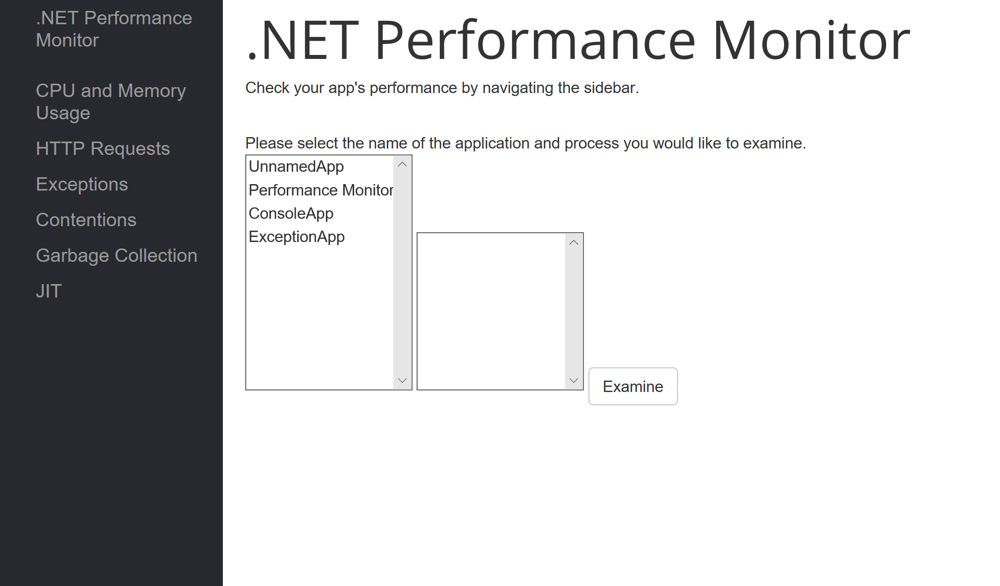
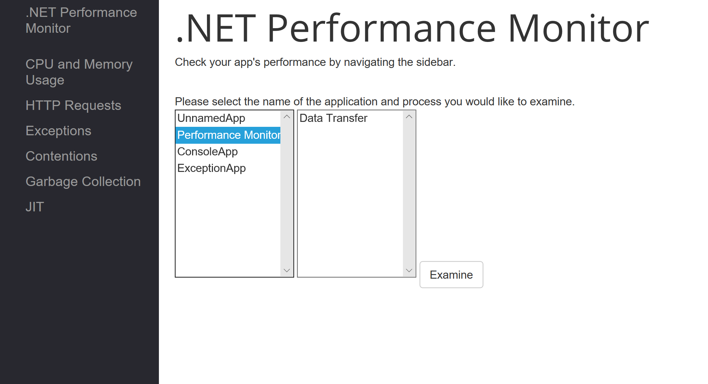
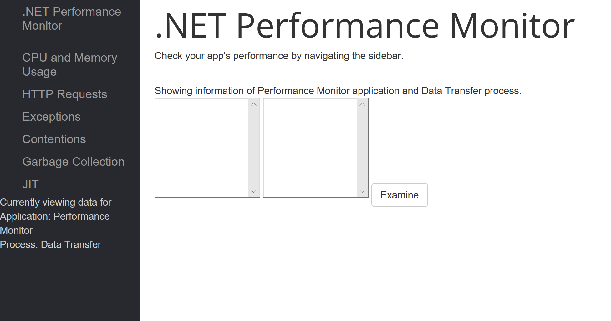
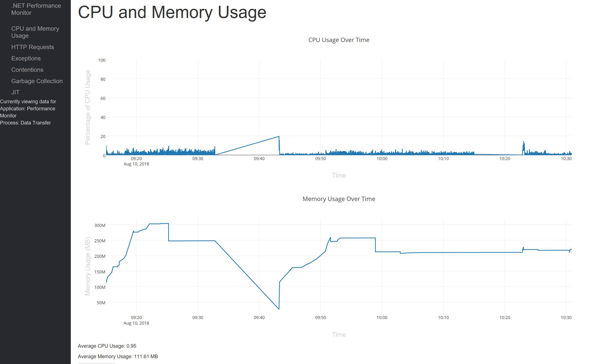
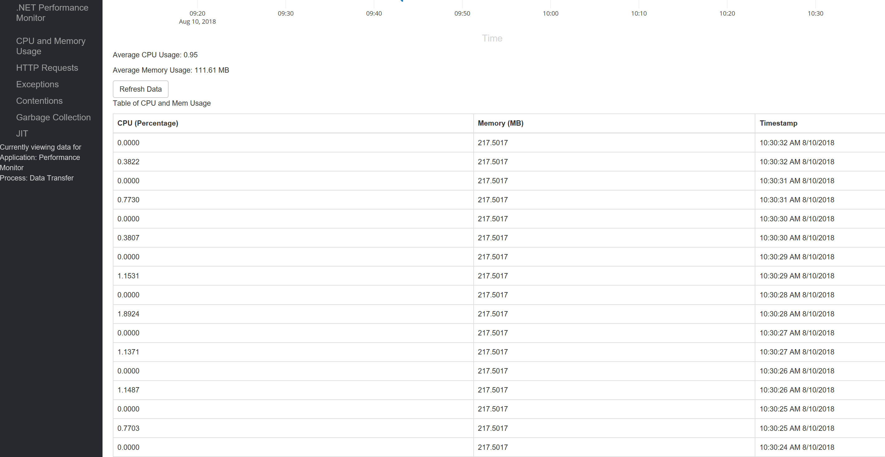

# .NET Core PerformanceMonitor
The Performance Monitor application allows .NET Core 2.1 developers to track application performance metrics via a web application. The application consists of three major components: performance data collection, data storage and handling, and data presentation. 

### Table of Contents
* What is the Performance Monitor?
* Architecture Overview
* Monitor Your Application
* Visualize Your Data


## What is the Performance Monitor?
The .NET Core Performance Monitor is a tool designed to help .NET Core application developers better analyze performance across all .NET-supported platforms. It is designed to not only run on multiple platforms, but also to be capable of analyzing performance of any type of .NET application from console apps to web apps. Most notably, this tool is designed to support detailed and holistic performance analysis of complex applications with multiple microservices as well as simple, single-process applications.

The Performance Monitor itself consists of a web application that can be connected to a user's application by using an installable class library. In a few simple steps, a user can view their application's performance data on the web application in real time, with data tables and live-updating graphs that display information relevant to any developer.

Coherent application monitoring can be performed by grouping distinct application processes within the same logical application while utilizing the class library. These processes can be distinct microservices that run in parallel within a single application, or different executable code files that can be logically grouped together. On the user interface, a developer can see their monitored processes grouped together by application for ease of access.

The data a developer chooses to view for their application is easily customizable and comprehensive. The Performance Monitor allows tracking of CPU usage, process memory usage, incoming Kestrel HTTP requests, exceptions, garbage collection, thread contention, and JIT events - as well as a number of performance insights inferred from these events. The tracking of each of these performance metrics can be easily enabled or disabled for each process, allowing a developer to record only the data that's relevant to their application.


## Architecture Overview


### Data Collection
Data collection is performed via a class library that can be utilized in the user's executable code for the application they want to monitor. All that is required to perform this tracking is to include the library, create a class instance, and call the class' Record() function.

This will trigger performance metric tracking that is done on the user's machine through two channels. The first of these channels is the _System.Diagnostics_ namespace, which is used to fetch information unique to the current process. This data includes CPU and memory usage, which is sampled at the specified or default rate.

The other channel for data collection is the TraceEvent library (repo found here: https://github.com/Microsoft/perfview/tree/master/src/TraceEvent). Using TraceEvent, the monitor can monitor certain exception, GC, contention, JIT, and incoming Kestrel HTTP request events. Handling events via TraceEvent is not done with a controlled sampling rate, since event responses are triggered live as events are discovered by the event parsers.

### Data Storage
Data is stored in a SQL database running on Docker, and data is moved throughout the system via HTTP requests that are handled using Entity Framework. More information about data storage and handling can be found in the programmer's guide within the repository.

### Data Presentation
The web application is built using ASP.NET CORE and Razor Pages to create a dynamic application. To start accessing the data, users must first specify the application and process name that they want to examine (collectively, the application and process are called sessions) on the homepage. The homepage automatically lists all applications that the database has data of. Once the user selects one one of the applications, all the assoicated processes of that application will show. Once the user enters all this information, the user is given feedback on whether or not a session with the entered information exists. If that session does not exist, an error is thrown and the user is prompted to re-enter the information. If the session does exist, the user can then use the sidebar to view data gathered from their session.

Navigating the metric pages is largely self-explanatory. The CPU and Memory graphs continuously update without requiring the user to refresh the page. All other tables require refreshing the page or clicking the refresh button above the table.

## Monitor Your Application

Visual Studio is required to run the performance monitor, which can be downloaded by following this link: https://visualstudio.microsoft.com/downloads/.

Application health monitoring is performed by a C# class library function that simply needs to be included in the beginning of the user's application code. The function will trigger application performance reading on the user's machine, and periodically send packets of data to be presented on the web application. To utilize this service, include the PerfMonitor library and write one of the following instantiation calls at the start of the tracked application's Main method or equivalent:

```cs
// Monitor class instantiation option 1:
Monitor monitor = new Monitor(String process_name, String application_name, int sampling_rate, int transmission_rate);

// instatiation option 2:
Monitor monitor = new Monitor(String process_name, int sampling_rate, int transmission_rate);

// instantiation option 3:
Monitor monitor = new Monitor(int sampling_rate, int transmission_rate);
```

After declaring a new instance of the _Monitor_ class using one of the above constructors, use the following code just beneath your instantiation statement:

```cs
// specify desired metrics
monitor.Record();
```

By default, only CPU and memory usage are recorded. To enable monitoring of any of the other available events (exceptions, GC, contention, JIT, HTTP requests), simply fill in the commented section in the above snippet with _monitor.Enable____. For example:

```cs
monitor.EnableGC();  // will enable monitoring of GC events
```

If you would like to disable monitoring of CPU or memory usage, the methods _DisableCPU()_ and _DisableMem()_ are available.

All arguments for _Monitor_ class instantiation are optional and a monitor can be created with only sampling and transmission rates specified, but specifying a process name is strongly recommended so that processes can be differentated on the web application. The default sampling rate is one sample per second and the default transmission rate (rate at which data is sent to the server) is five seconds. If a rate is specified, the arguments should be provided in milliseconds between sample/transmission and the sampling rate value should be smaller than the transmission rate value for expected performance.

Providing an application name will allow an application with multiple processes to have its processes grouped within the performance monitor's tracking. To do so, simply run performance monitoring for each process simultaneously, with each Monitor instantiation specifying the same application name. Below is an example of having multiple tracked processes within the same application:

Say we have a .NET process that we want to monitor, and it belongs to a multi-process application named "MyApp". We're fine with the default monitoring rates, but we want to track exceptions as well. So, we put the following code in our process' Main function:

```cs
Monitor monitor = new Monitor("Process1", "MyApp");
monitor.EnableException();
monitor.Record();
```

We also have a second process in this application that we want to track simultaneously. For this application, we don't need to check the performance data as often, so we set our sampling rate to one sample per 2000 milliseconds and our transmission rate to one transmission per 10000 milliseconds. We put the following code in the process' Main function:

```cs
Monitor monitor = new Monitor("Process2", "MyApp", 2000, 10000);
monitor.Record();
```

Now when we view the web application, we'll be able to see the performance of both processes factor into performance of the overall application. Below is a diagram showing the structure of the system:


If we were to additionally create two new processes - "Process3" and "Process4", respectively - with arbitrary sampling and transmission rates but no application name, the system would now look like this:



Each process can be viewed individually, but they will be organized under whatever application they belong to. This allows an application with multiple, distinct processes or microservices to be easily tracked as a cohesive unit.

Additionally, the monitor can be paused and continued at any point in your application's life cycle. A possible use of this functionality would be to monitor the performance of only certain functions or snippets of code by resuming a monitor at the beginning of a function and pausing at the end. To continue a paused monitor, use the Record() function; to pause the monitor, simply write:

```cs
monitor.Pause();
```

## Visualize your Data

Once the web application is spin up, the user is prompted to enter the application and process name of the session that they want to monitor. The web application would look similar to this.



Once the user clicks on an application name, all the associated process names will appear on the adjacent menu. 



Once the user clicks on a process name and clicks "Examine", the side bar will update to inform the user what session they are currently viewing data for and the menus will be cleared. 



Now, the user can utilize the sidebar to navigate between the different metric pages and view the data collected from their application. For example, once the CPU and Memory tab is selected on the sidebar, the user will see the CPU and Memory graphs (which live update), the average percentage cpu used, the average memory used, and a table. 




