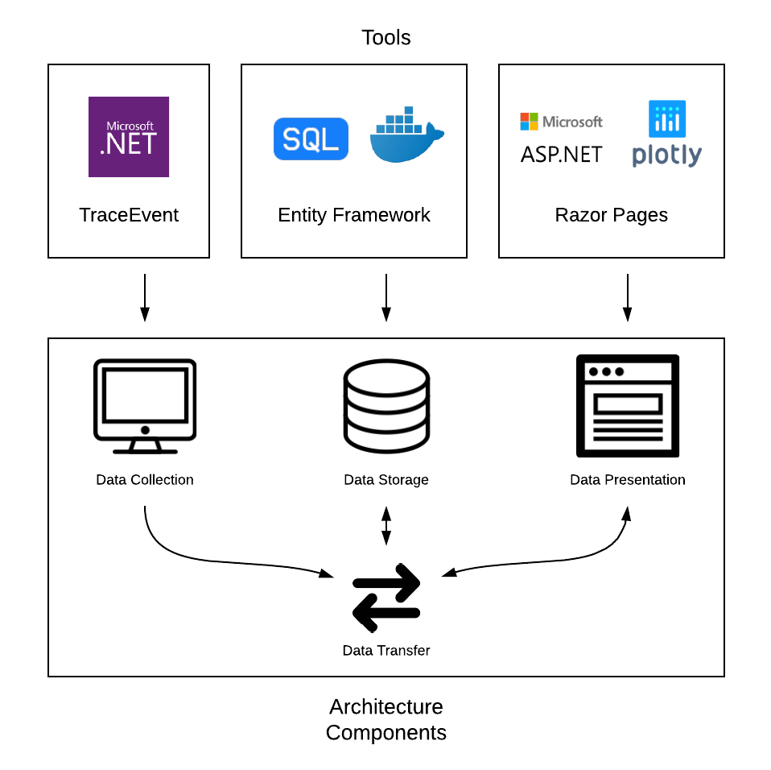

# .NET Core Performance Monitor

## Architecture Specifics



### Data Collection

Data collection is performed via a class library that can be utilized in the user's executable code for the application they want to monitor. All that is required to perform this tracking is to include the library, create a class instance, and call the class' Record() function.

This will trigger performance metric tracking that is done on the user's machine through two channels. The first of these channels is the System.Diagnostics namespace through the .NET Core API, which is used to fetch information unique to the current process. This data includes CPU and memory usage (which is sampled at the specified or default rate) as well as performance-related machine-specific information. Specifically, the running machine's operating system information and count of total logical processors is collected.

The other channel for data collection is the TraceEvent library (repo found here: https://github.com/Microsoft/perfview/tree/master/src/TraceEvent). Using TraceEvent, the monitor can monitor certain exception, GC, contention, JIT, and incoming Kestrel HTTP request events. Handling events via TraceEvent is not done with a controlled sampling rate, since event responses are triggered live as events are discovered by the event parsers.

### Data Storage

The data collected is currently being hosted on a SQL database running through Docker. This allows for local testing of the application. In the future, the database will be moved to AzureSQL. This will allow the final product to run with minimal setup from the user. Startup.cs holds the location of the connection string for the server, and can be changed as necessary.

Entity framework was used to manage the sending and fetching of data from the server. There are object-specific controllers for the fetching of data, and there is an all-purpose controller for sending the data in a single packet. Entity framework largely simplifies querying a SQL server, as no commands need to be written. The primary used POST request is POST/api/v1/General/ALL, which allows for pushing all the currently collected data to the server. The receiving of data is done by the specific page being used. Primarily, /api/v1/CPU/Daterange is being used to receive data from the server for CPU usage information. /api/v1/MEM/Daterange will be used to receive data for memory usage information. Data is sent and received in JSON form.

### Data Presentation

The web application is built through ASP.NET Core and Razor Pages. The data is received through the web API in JSON form and then deseralized into the custom classes for each metric. The Razor Pages use this data to perform data analysis and compile the useful information. Plotly requests data from the web API through the javascript fetch API and and constructs the graphs. 

## Functionality Specifics
### Data Collection

The actual code that performs data collection is Monitor.cs, within the PerfMonitor C# class library. It specifies the _Monitor_ class, includes all necessary C# libraries, and contains the functions that perform data collection and interfacing with the other components of the PerformanceMonitor project.
The performance metrics that are monitored by the PerformanceMonitor are as follows:

1. __CPU usage__

2. __Memory usage__
 
3. __HTTP requests__
  * Method
  * Path
  * Duration
  * Frequency

4. __Exceptions__
  * Type
  * Frequency
  * Most common

5. __Garbage Collection__
  * Type
  * Frequency

6. __Contention__
  * Duration
  * Frequency

7. __JIT events__
  * Method
  * Count
 
#### Recording Metrics (System.Diagnostics.Process class)
As mentioned above, CPU and memory usage are fetched via the _System.Diagnostics.Process_ class. By default, only CPU and memory tracking is enabled - to enable other metric tracking, function calls to enable each can be made before beginning recording (this will be covered in the TraceEvent tracing section). A new _Monitor_ class instance must be created for each process that a user would like to monitor, because the data is fetched by first calling Process.GetCurrentProcess();, which will return a _Process_ class instance. This class instance contains a number of fields that are used to track CPU and memory performance. CPU and memory usage will be sampled as often as the sampling rate dictates, while the other events, which are traced via TraceEvent, are collected as they are triggered. This is done by looping through a while(true) loop in the Record() function, and comparing the time elapsed on a Stopwatch between the last sample and the current time to the sampling rate.
 
##### CPU
Tracking CPU usage requires a small amount of overhead for calculation and comparison of a few variables. The total time that a machine's logical processors spend running the user's process is described by _Process.TotalProcessorTime_, and this is what is used to calculate the percentage of time that the processor (accounting for all logical cores) has spent running the user's code. The time between samplings in recording using DateTime objects, and the amount of time is multiplied by the number of logical cores (fetched by _System.Environment.ProcessorCount_) to determine the total amount of time that the processors can allocate to work during the interval. These values are used to generate a percentage of time spent running the process.
 
Like all other metrics that are collected, there is a unique class used by the project components in order to standardize data representation and make JSON (de)serialization easier for data sharing. All classes contain a field for a recording session instance (_Session_ class instance, which will be covered in the Data Transmission subsection below) and timestamp (DateTime specifying the instance the data was collected). The CPU class also contains a "usage" field, which is a double containing the percentage of CPU usage for a given sample. This class, like all other shared classes in the project, exists within the Shared class library.
 
##### Memory
Memory usage sampling is much more straightforward than CPU sampling - the process' memory usage can be fetched with a single fetching of the process' _WorkingSet64_ property. The memory usage class looks essentially identical to the CPU class, except the usage is stored as a long (the return value of the _WorkingSet64_ property). The memory usage recorded by the monitor is in total bytes.
 
#### Recording Metrics (TraceEvent library)
The rest of the collected metrics are discovered via the TraceEvent library. As mentioned before, these events are not sampled at regular intervals. Instead, delegate actions are set up in response to the discovery of events as they occur, through an independent task established upon calling _Monitor.Record()_. It's worth noting that due to data structure locking, all event tracing is paused for the duration of HTTP requests to the database which stores the performance metrics. This means that certain events, and certain CPU/memory usage data points, may go missing periodically (typically around startup).
 
The following event collection descriptions will mention terms and processes specific to TraceEvent, so  please refer to the TraceEvent programmer's guide (https://github.com/Microsoft/dotnet-samples/blob/master/Microsoft.Diagnostics.Tracing/TraceEvent/docs/TraceEvent.md) in order to gain a better understanding of how the library works.
 
##### HTTP Requests
HTTP request tracking is a feature specifically for use with ASP.NET Core applications. HTTP request events for ASP.NET Core apps are not native to the TraceEvent library, so a few lines of code must be provided in order to enable tracking with certain features:
 
```cs
session.EnableProvider(new Guid("2e5dba47-a3d2-4d16-8ee0-6671ffdcd7b5"), TraceEventLevel.Informational, 0x80);
var AspSourceGuid = TraceEventProviders.GetEventSourceGuidFromName("Microsoft-AspNetCore-Hosting");
session.EnableProvider(AspSourceGuid);
```
 
This will allow the Dynamic event parser to detect, among other events, HTTP request Starts and Stops. The first provider enabling line of code above also allows activity ID's to be associated with these events such that request Starts can be associated with their corresponding Stop (which allows request duration to be calculated). Furthermore, Start events contain within their event message the method and path of the HTTP request. In order to access this information, some string parsing has to be done with the event message that can be referenced in the code.
 
The HTTP request class contains - in addition to the session instance and timestamp - the HTTP event's type (String containing either "Start" or "Stop"), method (String only associated with Starts), path (String only associated with Starts), and activity ID (GUID).

To enable HTTP request tracking, insert the following code after the _Monitor_ class instance is declared and before beginning recording:

```cs
monitor.EnableHttp();
```
 
##### Exceptions
Exceptions, and all of the non-HTTP TraceEvent-tracked events, are detected by the same event parser (the ClrTraceEventParser). In order to enable event detection for all of the events we want within the parser's umbrella, keywords have to be referenced for the event types we're interested in when enabling the provider:
 
```cs
session.EnableProvider(ClrTraceEventParser.ProviderGuid, TraceEventLevel.Verbose, (0x8000 | 0x4000 | 0x1 | 0x10));
```
 
Using this style, any number of keywords (found in the TraceEvent repo) can be referenced for the parser's detection. In this case, we enable the detection of Exception, GC, Contention, and JIT events. Actually setting up a delegate response to event detection is detailed below, with the delegation for ExceptionStart events as the example:
 
```cs
// subscribe to all exception start events
clrParser.ExceptionStart += delegate (ExceptionTraceData data)
{
  // if exception was in user process, do stuff
  if (data.ProcessID == myProcess.Id)
  {
    // Stuff to be done
  }
};
```
 
The exception class contains all typical class fields in addition to a "type" field (String containing exception type).

To enable exception tracking, insert the following code after the _Monitor_ class instance is declared and before beginning recording:

```cs
monitor.EnableException();
```
 
##### Garbage Collection
For garbage collection, delegates must be set up for a number of different events since the GC "type" is not specified within a general GC event like it is for exceptions. For this reason, the data collector is set up to record GCStart, GCStop, GCAllocationTick, GCCreateConcurrentThread, GCSuspendEEStart, GCRestartEEStop, and GCTriggered events. Using the timestamps and matching thread ID's of GCSuspendEEStart and GCRestartEEStop events, it's possible to determine how much time was set aside for performing garbage collection within the user's process. In addition to the typical class fields, the GC class contains a "type" field (String detailing event name) and thread ID field (int).

To enable GC tracking, insert the following code after the _Monitor_ class instance is declared and before beginning recording:

```cs
monitor.EnableGC();
```
 
##### Contention and JIT
Both contention and JIT events are very straightforward in how they are tracked. ContentionStart and ContentionStop events are correlated by activity ID to determine time per contention, and JIT events are recorded every time a method within the process is jitted. The contention class includes a "type" field (String - "Start" or "Stop") as well as an activity ID field (GUID), and the JIT class includes the jitted method's name (String). Method jitting will typically be heaviest upon startup and then fall off in frequency.

To enable contention event tracking, insert the following code after the _Monitor_ class instance is declared and before beginning recording:

```cs
monitor.EnableContention();
```

To enable JIT event tracking:

```cs
monitor.EnableJit();
```
 
#### Client-Side Data Storage and Transmission
There are two more shared classes within the project, in addition to the classes for each metric type: a _Session_ class and a _Metric_List_ class. These are used to provide more context to the data being collected and to allow data to be cleanly transmitted.
 
##### The _Session_ class
The _Session_ class is meant to contain information unique to a user's process and michine that will help the user 1. identify and recognize unique processes within a single application, and 2. understand performance metrics in the context of the local machine's environment. The class has six fields: 

```cs
public partial class Session() 
{
    .
    .
    .
    public string application { get; set; }   // String containing the user-specified application name
    
    public string process { get; set; }       // String composed of the process' name, as specified by the user
    
    public string os { get; set; }            // String describing the machine's operating system (from Process class)
    
    public int? sampleRate { get; set; }      // int - milliseconds between CPU and memory measurements
    
    public int? sendRate { get; set; }        // int - milliseconds between transmission of batched data
    
    public int? processorCount { get; set; }  // int - number of logical processors on machine (from Process class)
    
    public int Id { get; set; }               // int - key generated for database organization
    .
    .
    .
}
```
 
##### The _Metric_List_ class
The _Metric_List_ class is meant to be used for data packaging and efficient sharing between the different components of the project. Its fields are: "session", "cpu", "mem", "exceptions", "requests", "contentions", "gc", and "jit". The session field contains an instance of the _Session_ class for the current process - this will not change throughout the running of a single process. Each of the fields corresponding to a performance metric type is a Collection of class instances for the given type.

These Collections are the means by which data is stored on the client machine before it is batched and sent to the server. Data only persists on the client side for the duration of time between these transmissions, which is dictated by the transmission rate of a particular _Monitor_ class instance. To ensure thread safety of the program, a sequence of steps is followed when handling these data structures:

1. Globally accessible Collections are created for each unique data type/metric at the start of the program:

```cs
// for example, the exception data Collection - this pattern is followed for each metric
public static List<Exceptions> ExceptionVals = new List<Exceptions>();
```

2. A global _Object_, lockObject, is instantiated:

```cs
Object lockObject = new object();
```

3. At any point in the code where a data point is collected, attempt to add the data point (abstracted into the form of a class instance) to the appropriate Collection. Only add the data point if the lock object is not being held elsewhere, which indicates that the Collection is free to be mutated:

```cs
if (ExceptionEnabled)  // if user has enabled exception data tracking
{
    // subscribe to all exception start events
    clrParser.ExceptionStart += delegate (ExceptionTraceData data)
    {
        // if exception was in user process, add it to list of exceptions
        if (data.ProcessID == myProcess.Id)
        {
            // create a new data point
            Exceptions e = new Exceptions();
            e.type = data.ExceptionType;
            e.timestamp = DateTime.Now;
            // "instance" contains session-specific data
            e.App = instance;
            
            // add the data point to the Collection if lock isn't held elsewhere
            lock (lockObject)
            {
                ExceptionVals.Add(e);
            }
        }
    };
}
```

4. Ensure that these Collections are being exclusively worked with when aggregating data into a _Metric_List_ instance for transmission via a lock. Additionally, redirect the pointers associated with the Collection names to a new set of Collections (this will "refresh" the locally held data by pointing to new, empty Collections - as well as ensure _Metric_List_ fields aren't pointing to data that will be mutated by TraceEvent during JSON serialization):

```cs
// if specified time has passed since HTTP request was made
if (timer.ElapsedMilliseconds >= sendRate)
{
    timer.Restart();
    // creates object that will store all event instances
    Metric_List list = new Metric_List();

    lock (lockObject)
    {
        // fill list with Collections containing data points
        list.cpu = CPUVals;
        list.mem = MemVals;
        .
        .
        .

        // create new pointers for metric value collections
        CPUVals = new List<CPU_Usage>();
        MemVals = new List<Mem_Usage>();
        .
        .
        .
    }

    // serialize the Metric_List into JSON in order to transmit to server
    String output = JsonConvert.SerializeObject(list);
    
    // send HTTP request with appropriate data
}
```
 
### Data Presentation

The web application that supports the UI is an ASP.NET Core application that is named WebApplication within the src folder. Largely, it is broken up into 3 folders: Pages, Services, ClientSideData. The Pages folder contains Razor Page files, which is contains a Metrics folder (contains Razor Pages for all metrics), Shared folder (defines general layout that is seen throughout the website), and other cshtml files (Index.cshtml is the homepage). 

#### Fetching Data for Metrics

Every Razor Page for the metrics communicates with the FetchDataService file under the Services folder to retrieve data for their respective tables. The getData(DateTime oldStamp, DateTime newStamp) method calls the web api and returns a list of objects which represent a metric (can be any one of the shared classes because the method is generic). The method is passed parameters so that it can return data within the date range specified by the parameters and utilize the controllers that send data caught between a certain date range. This reduces the overhead and only transfer necessary information. 

To call the web api, a new instance of an HttpClient is declared and the base address is defined. For now, the base address is hard coded in Startup file as the string apiDomain but can be made configurable later on as well. Then, the method starts constructing a string that will serve as the http request when the web api call is made. The method was made generic so that this method could be used to get information on any metric. Therefore, the controller which this method calls is not hard coded and must be determined by examining the type of object that this generic function is being used for. Depending on this type of object, the string named type is updated. The DateRange controllers take in a start and end parameter, which are the oldStamp and newStamp respectively. In order to make these variables url safe, the convertDateTime(DateTime d) method is utilized (an appropriate DateTime method could not be found and so this method was manually made). Becuase each all data is linked to a session id, the controllers also require a session id number. The string sessionId will be the portion of the string that specifies the sesion id in the http request. All these components of the http request are strung together to make a request. The GetAsync method actually makes the request. The response of that request is stored and if successful, the data is deserialized. 

```cs
HttpResponseMessage response = await client.GetAsync("api/v1/" + 
                type + 
                "/Daterange?start=" + 
                dateRange +
                sessionId);
```

For all metrics, the controllers require a date range. However, for the sessions controller, a date range is not required because all the sessions must be shown on the homepage. Therefore, the method getSessionData is separated from getData. This method calls the web api in a similar manner but just calls upon a different controller that takes in 0 parameters. 

#### Razor Pages for Metrics

For each metric that the Performance Monitor tracks, it has a separate Razor Page that makes individual Http requests to the server through the generic class FetchDataService. A Razor Page contain a cshtml file (which is comparable to an html file and determines the physical layout of a page) and a cshtml.cs file. While each Razor Page may operate differently and do different tasks with the data it recieves, for all Razor pages, the cshtml.cs file communicates with the FetchDataService class (explained in detail above) to retrieve data for the tables. The getData method (that is defined in FetchDataService) is called upon in the OnGet() method of the Razor Page. The OnGet() method is triggered every time the page is loaded or refreshed so data is updated everytime the page is refreshed. This data is then displayed on a table in the associated cshtml file. A refresh button is provided so that the users can refresh the page and see the most current data on the tables.

#### Fetching Data by Javascript Fetch API

Data for live updating is retrieved through the Javascript fetch api. Let us look at the Javascript code for the CPU graph under CPU_Memory.cshtml to get a better understanding of how the fetch api is implemented. For live updating, the fetch api must be triggered every so often. To facilitate this functionality, the actual implementation of the fetch api is separated into a getCPUData method, which takes in two parameters: start and end. Similar to the getData method in FetchDataServices, the controllers that utilize date range will be used and therefore getCPUData is given these parameters. Using these parameters and the apiDomain as the base address, a string is constructed that will be the HTTP request. The method then returns the following, in which the url is the http request string that was constructed. To allow the browser to give permission for the web application to make requests to a domain that is not its own, cors must be enabled. If the response is successful, then the response is converted to a JSON and then deserialized by the JSON.parse method. All these steps are split up into .then() methods because they ensure that the code is executed in the order specified. 

```cs
return fetch(url, {
                method: 'GET',
                mode: 'cors',
                headers: {
                    "Accept": "application/json",
                    'Access-Control-Allow-Origin': '*',
                    "Content-type": "application/json"
                }
            })
            .then(response => {
                    if (response.ok) {
                        return response;
                    } else {
                        return Promise.reject(response);
                        throw Error(response.statusText);
                    }
                })
                .then(response => response.json())
                .then(function (data) {
                    var dataArray = JSON.parse(data);
                    // Some data manipulation
                    return finalizedData; 
                });
```

This method is actually called in the following code. The Promise.all ensures that the array of objects that utilize the fetch api are all resolved and return a response before executing the code inside the promise method. 

```cs
Promise.all([getCPUData(startCPU, endCPU)]) {...}
```

This gets the initial data but for the live updating, the getCPUData method must be called frequently, which is done through this code. 

```cs
.then(setInterval(function () {
    ...
}, @IndexModel.userSession.sendRate * 1.1)); 
```

After the initial data has been gathered, the setInterval method executes the function method every sendRate * 1.1 miliseconds. The function method contains a call to the getCPUData, thus triggering an http request to the api continuously. The interval is set to the sendRate of the session multiplied by a factor of 1.1 to ensure that the web application does not make uneccessary requests. Had it been multiplied by a factor of less than 1, it is guarenteed that some of the requests would give back empty results because the requests are being triggered faster than the data is being transferred to the server.

The fetch api is implemented in the following manner to live update the CPU and memory graphs as well as the Jit, garbage collection, and exceptions table. The live updating tables is not implemented for the CPU/memory, contentions, or http requests table because the fetch api is simply getting data on the client side and therefore cannot process the data on the server side. CPU/memory datapoints must be paired by timestamps whereas contentions and http requests must be paired by their ids so that the duration of an event can be calculated. For these reasons, live updating tables have not been implemented for these metrics. 

#### Graphs with Plotly

Plotly is used to graph the CPU and memory graph and uses the fetch API as discussed above to continuously get the current data. The initial graph is plotted once the initial data is fetched. Let us take a look at the CPU graph. Plotly.plot is passed 'cpu' (div in which the graph will be shown), CPU (contains data for xaxis and yaxis), and layout (defining other physical aspects of the graph). 

```cs
 Plotly.plot('cpu', CPU, layout);
```

To extend the lines in the graph, the Plotly.extendTraces method is used. It is passed 'cpu' (div in which the graph will be show), update (contains the datapoints of the new data), and an array specifying which trace is to be extended. In this case, the CPU graph only contains one trace and so the array [0] is passed. 

```cs 
Plotly.extendTraces('cpu', update, [0]);
```

To show only the most relevant data, the last 15 minutes are shown on the graph. This is done by the Plotly.relayout method. Once again, this method is passed 'cpu' (div in which the graph will be shown), and minuteView (array specifying the time range which the graph should display).

```cs
Plotly.relayout('cpu', minuteView);
```

#### Data Analysis

The following measurements are given for the associated metrics.

##### CPU and Memory 
* Average CPU usage
* Average percentage of memory used

Because either CPU or memory could be disabled, the table must be able to reflect those changes. As a result, a dictionary is used to pair the CPU and memory data. This dictionary is then sorted so that the data can be shown in a chronological order in the CPU and memory table.

##### HTTP Requests
* Duration of each HTTP request
* Average duration of all HTTP requests
* Total number of HTTP requests

The start and stop events of an HTTP request are matched by the HTTP request ids. So, a dictionary is kept with the ids as the keys and the start times as the values. Once a stop event is identified, the respective start event is found through the dictionary and the duration is calculated by taking the difference between the start and the stop timestamps. 

##### Exceptions
* Exception by frequency
* Total number of exceptions

To keep track of the most frequent types of exceptions, a dictionary is kept with the key being the types of exceptions and the values are the amount of times that exception has been seen. While the table that lists all the exceptions is updated continuously (through the fetch API), the exception by frequency table or the total number of exceptions is not updated continuously. As mentioned previously, the data analysis must be performed on the server side and the new data is only being received on the client side of the web application. So, to update the total number of exceptions or the exception by frequency table, the user must refresh the page or click the refresh button. 

##### Contentions
* Duration of each contention
* Average duration of all contentions
* Total number of contentions

Implemented in the same manner as HTTP requests.

#### UI Design
  
The design of the web application is specified in the .cshtml files of each Razor Page. There is a shared _Layout.cshtml page that dictates the design of the sidebar. The sidebar points towards all the different Razor pages metrics. The contents of the individual metric Razor Pages then solely are responsible for the metric content portion of the web page.

## Testing
### Data Collection

The _MonitorTest_ project within the solution contains C# classes that are each used to test a particular type of metric collection. The project's executable file is Program.cs, which contains only a Main method. In order to run a test for a particular metric, uncomment the metric's test line within Main - for example, to test collection of GC events, uncomment the line reading "GCTest.Test();". Then run _MonitorTest_, and GC events will be triggered for debugging. As it stands, only one test can be run at a time (if multiple lines are uncommented, only the first test to appear in the code will run).

__IMPORTANT__: When running _MonitorTest_, a console window will pop up and display the program's output. In order to safely terminate the program, press Ctrl+C before closing the window. If Ctrl+C is not pressed, the session allowing TraceEvent to run and collect events may not terminate. The next run of _MonitorTest_ would attempt to recreate the same session, and an error would be triggered. If you forget to Ctrl+C and run into this error, open up your machine's terminal or command prompt and run the command "logman stop MySession -ets". This will close the session, and you will be able to run _MonitorTest_ again.

In addition to manual triggering of events through the _MonitorTest_ project, there is also a _MonitorUnitTest_ project that contains unit tests in the form of xUnit tests. There are currently two unit tests: one tests the frequency of HTTP requests being sent to the server to make sure that requests are being made as often as specified. The other tests the number of CPU data points being collected per HTTP transmission cycle to ensure an expected number of samples is being taken. Currently, both tests operate with the sampling and transmission rates specified by the _Monitor_ class instance declared at the start of the _MonitorTest_ project's Program.cs file. Tests in this file are called by the xUnit tests in order to allow the monitor to run until a steady state of performance is reached and results can be sampled.

## Moving Forward

### Data Presentation

In the future, an useful addition to the performance monitor would be the implementation of SignalR so that the server side of the web application can continuously request new data and update both the list of objects it holds as well as any data analytics appropriately. This would allow for the tables to be updated continuously. Although not explored, but if SignalR is implemented, it is thought that the fetch API would not be needed even for the graphs (as there is no point in requesting the same data from both the client side and server side). 

In addition, the UI/UX could be improved upon. Here are a few examples of changes that could be put into effect.
* When looking at the top exceptions and selecting a specific type of exception, those types of exceptions are highlighted within the table that contains all the exceptions. This way, a user could pinpoint the specific times that these popular exceptions occured and perhaps use this information to figure out a trend. 
* Put a toggle button on top of the exceptions by frequency that allows users to just see the top 5 exceptions or all the exceptions sorted by their frequency.
* Allow for more customization in the CPU and memory graphs. For example, see the past 10 minutes or see the past hour. See the past 100 datapoints or see all datapoints so far. 
* Implement a better algorithm that determines what the most relevant data is. This depends on the sending rate of the session, how long the session has been monitored for, when the monitoring took breaks, etc. 
* Cross process analysis. This could allow users to compare multiple sessions by bringing up the data for all the sessions side by side. This could be further extended by having the graphs overlaid on top of each other to make the comparison of the sessions easier or having the tables include all the data points in an easy to read table.
* Graphs could be implemented for metrics other than CPU and memory. For example, there could be a graph showing amount of HTTP requests made over time (this could be generalized to GC events over time, or exceptions over time). 
